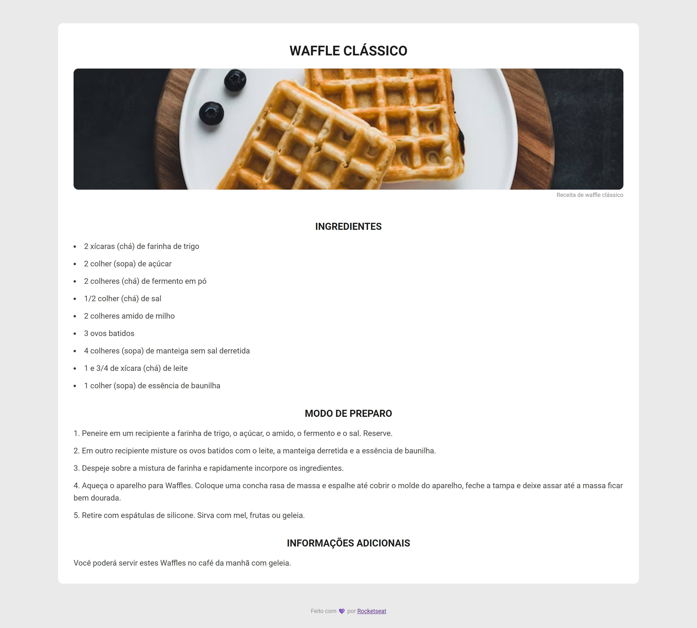

# Página de Receita

## Projeto 💻
Projeto de um desafio da Rocketseat de criar uma página web de uma receita com título, imagem, lista de ingredientes e modo de preparo.  

## Instalação 🛠
Siga esses passos para instalar o repositório na sua máquina:
1. Rode `git clone https://github.com/miishiyama/Pagina-de-Receita` para fazer um clone desse repositório.

## Tecnologias 🚀
As tecnologias utilizadas neste projeto são:
- HTML
- CSS

## Créditos ❤️
Feito por [Millene Eduarda Ishiyama](https://github.com/miishiyama/).
